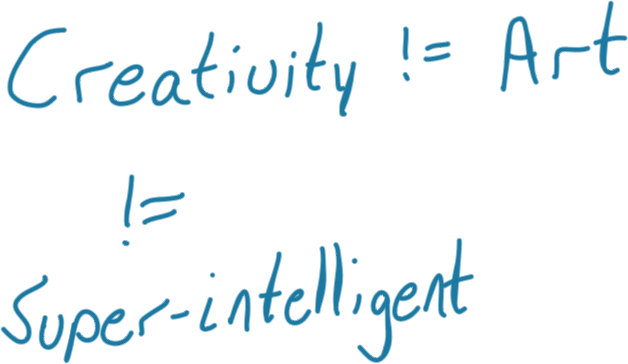
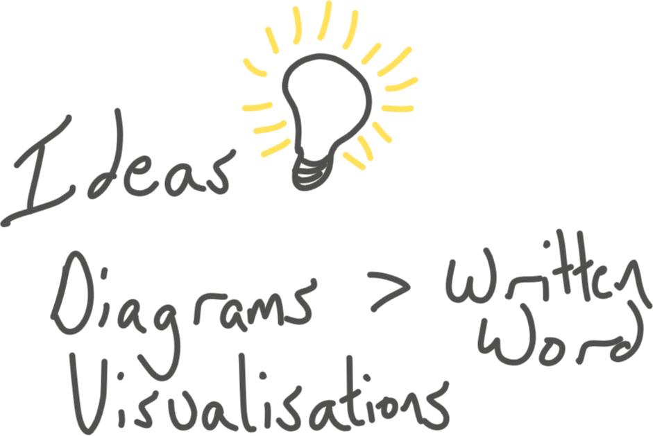
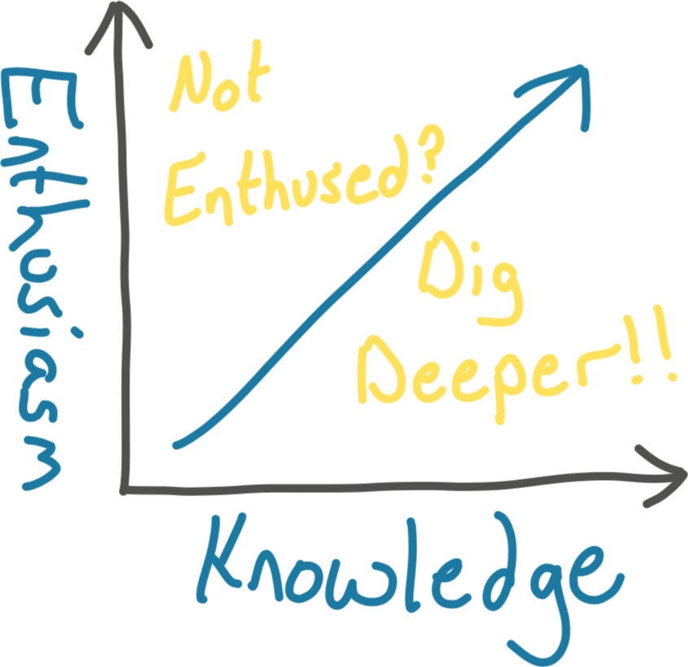

# The Magic of Thinking Big

Author: David J. Schwartz PHD, leadership consulting firm, “life strategist”

# Arguments
You are what you think.
* Think…big…like a leader
* Big goals == big success

# High level Questions & thoughts
* Mind if for thinking not memorizing facts & figures p.37
* Add value p.89 
* “Small people hold you back” e.g., a small person is someone petty and worried about things that “big people” don’t worry about p.151
* Go “first class” e.g., Go all out on the things that matter. Someone fitting you for a $200 suit pays much more attention and gives more care than someone buying a $100 suit (please do some inflation adjustment on this, ha) p.163
* Like able by being “lighter to lift”...check later notes for more on this p.194
* 10 yr plan p.255
* 30 day improvement plan p.268
* Progressive thinker p.293

# Important terms
* Action(s)
* Appearance
* Attitudes
* Confidence
* Creative Thinking
* Defeat
* Employees
* Enthusiasm
* Excuse this
* Failures
* Fear
* **Goals**
* **Ideas**
* Jobs
* Leadership
* People
* Success
* **Thinking**

# Key Insights
> Knowing you are on the road to success is fulfilling in & of itself  
- Make a note of all the ways to define success

> Leaders don’t pull themselves up, they are lifted by those around them. Getting people to do what you want takes leadership qualities. Which enables results. **Do not feel bad about coercing people to do what you want. Sometimes YOU KNOW BETTER.** (But don’t be a dick)  

> Refuse petty people  

# Tools / Worksheets
* How Am I Thinking p.144
* Grow the “I’m Activated” attitude p.190
* 10 year planning guide p.255
* Fear —> Action p.54
* Measure your true size p.77
* Develop big thinker’s vocabulary p.81
* See what _can_ be p.89
* 3 stage program to strengthen creativity through asking & listening p.118
* “People First” rules p.195
* Thirty Day Improvement plan p.269
* Action Plan for Goals p.273
* Living Progressive Leader p.293
* Using the magic of thinking big p.301

# Excusitis
Speaks on many different types of excusitis (e.g., health) but the one the really resonated with me was **intelligence**
## Intelligence Excusitis p.32
> Stickability is 95% of ability  
This stems from... 
1. Underestimating your brain power
2. Overestimating other’s brain power
> The thinking that guides your intelligence is much more important than how much intelligence you may have  

Leaders are _human engineers_

> Attitudes > Intelligence  

## Fear
> Action cures fear  
**Prime cause of low self-confidence** ::Mismanaged memory::
### Fear of people p.62
1. Get a balanced view of the other fellow
2. Develop an understanding attitude. Remember to repeat...::Underneath he’s probably a very nice guy Most folks are:: —Hotel Clerk story

> Do what’s right and keep your confidence  

### Think Confident, Act Confident p.69
1. Be a front seater - builds confidence. “Nothing inconspicuous about success”
2. Practice making eye contact
3. Walk 25% faster
4. Practice speaking up
5. Smile big

## How to think BIG p.75
Communicating to others - projecting a “movie” in their head
Here are some examples...
_We face a challenge_ —> _We have a problem_
_We made a big investment_ —> _We incurred a large expense_

> Big thinkers are specialists in creating positive, forward-looking optimistic pictures in their & other’s minds p.79  

### How to think creatively p.101
::Believe that you can create!::

> Progress is your most important product p.111  
1. Believe it can be done. **When you believe, your mind finds ways to do**
2. Don’t let tradition paralyze your mind. _Be receptive to new ideas_ and _new approaches_
3. **How can I do...** successful combo below
	1. better? (Quality)
		1. No limit to self-improvement!
	2. More? (Quantity)
		1. Capacity is a state of mind. 
		2. Helps to find intelligent shortcuts
4. Practice asking & listening - the raw material of sound decision making
	1. ::Big people monopolize the listening, small people monopolize the talking.::
5. Stretch your mind
	1. Stimulate
	2. Associate w/ people who help you think of new ideas
	3. Mix with _people of varying occupational & social interest_

> Belief releases creative powers  

Asking & LIstening: test your own views in the form of questions: “_What do you think of..._”

## You are what you think you are p.131
::Pay 2x & buy half as much::

> Sell yourself as a commercial p.142  

## Manage your environment: go first class p.147

Broadcast your good news. “We’ve got good news, team!!”

“Service first” approach to making money. Pretty much in line with what I already practice. Do quality work and the pay will take care of itself.

## Think right toward other people p.193
> Success depends on the support of other people  

## Get the action habit p.212
Writing or doodling or diagramming _moves the spirit_
> Don’t wait for the spirit to move you, you move the spirit!! ^^  

**::Action cures fear::**

## How to turn defeat into victory p.235

## Use goals to help you grow p.252
10 year visualization on p.256

Multiple departments in your life.
* Home
* Social
* Work

::Work influences the other two the most.::

thirty day improvement plan p.269
action plan p.273

## Think like a leader p.275
> You do not pull yourself, you’re lifted by others.  
### Leadership principles p.275
1. Trade minds w/ the people you want to influence
2. Think: What is the human way to handle this?
3. Think progress. Believe in progress. Push for progress.
4. Take time out to develop thinking power
review “Am I a progressive thinking? On p.293 for reminders on how to put yourself in this mindset